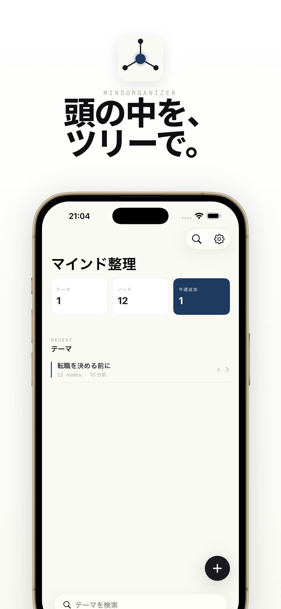
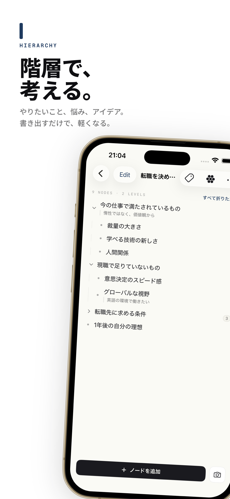
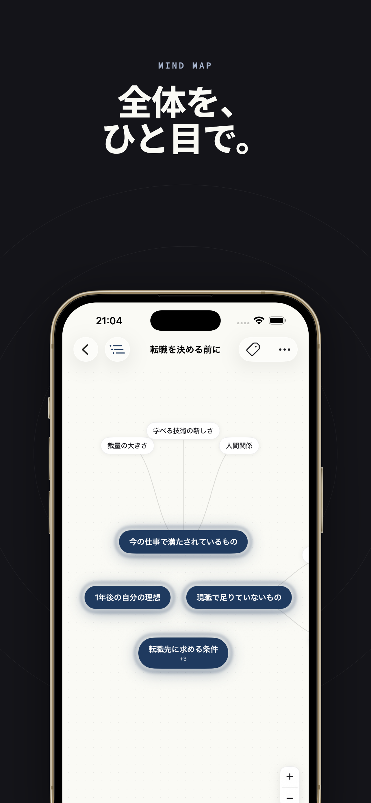
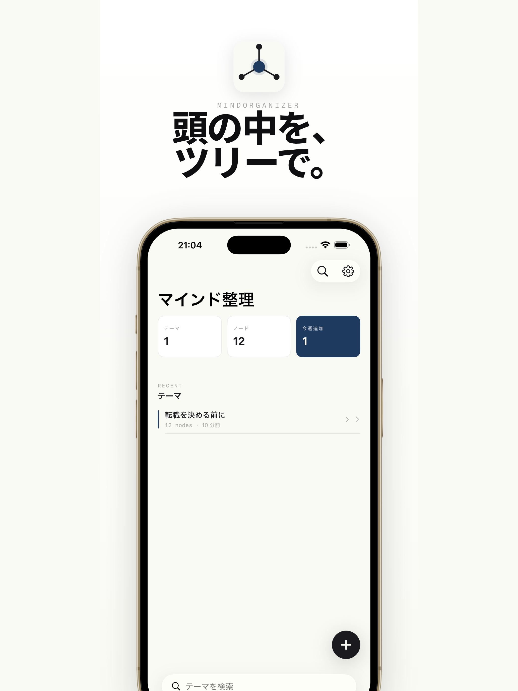
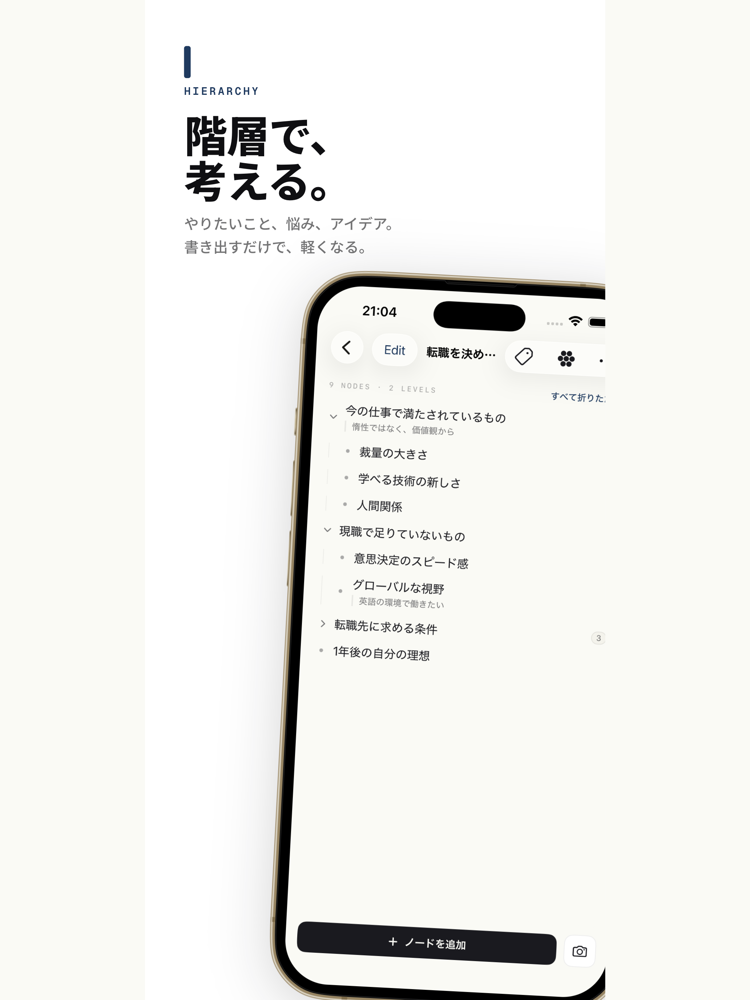
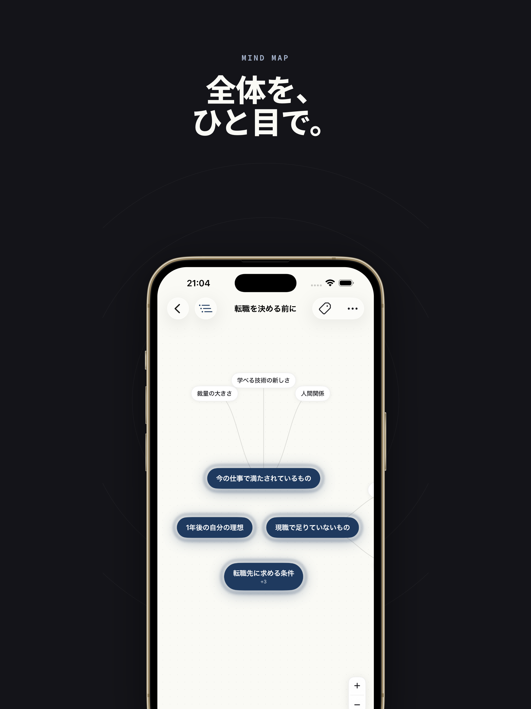

# MindOrganizer

> 頭の中のモヤモヤをツリー形式で整理する iOS アプリ

[](https://apps.apple.com/jp/app/mindorganizer-%E3%82%BF%E3%82%B9%E3%82%AF-%E3%83%9E%E3%82%A4%E3%83%B3%E3%83%89%E7%AE%A1%E7%90%86/id6763920793)
[](https://swift.org)
[](https://www.apple.com/ios/)
[](LICENSE)

<p align="center">
  
</p>

---

## 目次

- [作った背景](#作った背景)
- [主な機能](#主な機能)
- [スクリーンショット](#スクリーンショット)
- [技術スタック](#技術スタック)
- [アーキテクチャ](#アーキテクチャ)
- [苦労した点](#苦労した点)
- [工夫した点](#工夫した点)
- [リリース](#リリース)
- [ライセンス](#ライセンス)

---

## 作った背景

### 自分の言語化の改善記録として

頭の中で考えていることを、そのままにしておくと整理されないまま流れていってしまう。
「考えている」と「言語化できている」は別物で、書き出すことで初めて自分が何を考えているか分かる、という体験を何度もしてきた。

このアプリは、その **言語化のプロセス自体を記録に残す** ための場として作った。
ツリーに書き出し、深掘りし、並べ替え、タグを付けることで、思考の輪郭が見えてくる。
スナップショット機能で「あの時こう考えていた」を後から振り返れるのも、自分の思考の変遷を記録する手段として意識した。

### Todo アプリから一歩拡張した機能を作りたかった

Todo アプリは多くあるが、項目を平面的に並べるだけのものがほとんど。
人の思考は本来 **階層構造** を持っていて、「A をやるには B が必要で、B には C と D が含まれていて...」というツリーで表現する方が自然な場面が多い。

「Todo の親子関係を扱えるアプリ」から発想を広げ、**思考そのもののツリー化** を主役にしたアプリとして作り上げた。
マインドマップ表示や横断検索、タグ管理など、単純な Todo アプリでは無理な機能をのせていくことで、思考整理ツールとしての独自性を出している。

---

## 主な機能

- **ツリー編集**: 階層を持ったノードで思考を構造化。ドラッグ&ドロップで自由に並べ替え。最大20階層
- **マインドマップ表示**: ツリーをそのまま放射状マインドマップで表示。全体の関係性を一目で把握
- **タグ管理**: ノードにカラフルなタグを付けて分類。タグから横断検索も可能
- **スナップショット**: 重要な節目でツリーを保存し、思考の変遷を後から振り返れる
- **マークダウンエクスポート**: 作成したツリーを Markdown 形式で書き出し
- **ホーム画面ウィジェット**: 最近編集したテーマをホーム画面から素早く確認
- **ローカル優先設計**: オフラインで全機能動作。ログインなしのゲストモードあり
- **クラウド同期 (オプション)**: Apple Sign-In / Google Sign-In でログインすると複数デバイス間で自動同期

---

## スクリーンショット

### iPhone

<p align="center">
  
  
  
</p>

### iPad

<p align="center">
  
  
  
</p>

---

## 技術スタック

| レイヤー | 技術 | 選定理由 |
|--|--|--|
| 言語 | **Swift 6** | iOS 開発のスタンダード |
| UI | **SwiftUI** | 宣言的記述。外部 UI ライブラリを使わず審査リスクを下げる |
| ローカル DB | **SwiftData** | iOS 17+ の最新永続化フレームワーク。Core Data の半分のコードで書ける |
| クラウド DB | **Cloud Firestore** | NoSQL、リアルタイム同期、オフライン対応が標準 |
| 認証 | **Firebase Authentication** | Apple Sign-In / Google Sign-In を統一 API で扱える |
| 状態管理 | **@Observable** マクロ | iOS 17+ の最新 API。`ObservableObject` より記述が簡潔 |
| 並行処理 | **Swift Concurrency** | `async/await` + `@MainActor` でコンパイル時にスレッド安全性を保証 |
| ウィジェット | **WidgetKit + App Group** | 本体アプリと SwiftData コンテナを共有 |
| テスト | **XCTest** + **Swift Testing** | 両フレームワークを使い比べて学習 |
| CI/CD | **Xcode Cloud** | 証明書管理が自動、App Store Connect 連携がシームレス |
| 依存管理 | **Swift Package Manager** | 標準ツール |
| プロジェクト生成 | **XcodeGen** | `project.yml` で宣言的に管理。差分が読みやすい |

---

## アーキテクチャ

**MVVM + Repository パターン** + **ローカル優先 (Local-First)** を採用。

```
View (SwiftUI)
   ↓  ↑   バインディング (@Bindable)
ViewModel (@Observable + @MainActor)
   ↓
Repository (Protocol で抽象化)
   ├─ LocalRepository  → SwiftData      (オフライン / 高速 / Source of Truth)
   └─ RemoteRepository → Cloud Firestore (デバイス間同期手段)
```

### 設計思想

- **ローカル優先**: SwiftData がデータの正本 (Source of Truth)。Firestore はあくまで同期手段で、ネットワーク障害時もアプリは動き続ける
- **Repository を Protocol で抽象化**: ViewModel はデータがローカルから来たかクラウドから来たかを意識しない。テスト時は Mock を渡せる
- **ゲストモード必須**: App Store 審査 5.1.1 対応。ログインなしで全ローカル機能を提供
- **Last-Write-Wins**: `updatedAt` を比較して新しい方を採用。シンプルなコンフリクト解決

---

## 苦労した点

### 1. @Observable で View が再描画されない

ViewModel のプロパティを更新したのに、SwiftUI の View が見た目上何も変わらない、という問題に遭遇した。

```swift
@Observable
final class TreeEditorViewModel {
    var nodes: [ThoughtNode] = []  // ThoughtNode が class

    func updateNode(at index: Int, text: String) {
        nodes[index].text = text  // データは更新されるが View が気づかない
    }
}
```

**原因**: `@Observable` は **プロパティへの読み取り・書き込みを追跡** する。配列要素 (class インスタンス) の内部を直接変更しても、配列 `nodes` 自体の参照アドレスは変わらないので「何も変わっていない」と誤認されて再描画されなかった。

**解決**: 子オブジェクトを `@Model` (SwiftData) に揃え、SwiftData が内部で行うプロパティ追跡に乗せて変更を伝播させた。

### 2. @MainActor の概念と「いつ付ければいいか」が分からなかった

サンプルコードで頻繁に出てくる `@MainActor` というアトリビュート。最初は「動かすための呪文」として扱っていて、付けたり外したりで Xcode のエラーを通り抜けていた。

**原因**: 前提知識が抜けていた。

- iOS には **メインスレッド** という UI 描画専用の特別なスレッドがある
- UI 更新はメインスレッドからしか許可されない (違反すると実行時クラッシュ)
- Swift Concurrency の **actor isolation** という概念を知らないと `@MainActor` の意味が掴めない

**解決**: 順序立てて学び直した。

1. メインスレッド = UI 専用、というルールを理解
2. 旧来は `DispatchQueue.main.async` で手動切り替えしていた前史を把握
3. `@MainActor` = 「メインスレッドでの実行をコンパイル時に保証するマーク」と理解
4. **ViewModel / View / UI 結果を返す Repository には付ける、純粋計算・重い処理層には付けない** という判断軸を獲得

呪文ではなく「意味のある制約宣言」として使えるようになった。

---

## 工夫した点

### Repository を Protocol で抽象化

```swift
@MainActor
protocol ThoughtRepositoryProtocol {
    func fetchAllTrees() async throws -> [ThoughtTree]
    func saveTree(_ tree: ThoughtTree) async throws
    func deleteTree(id: String) async throws
}
```

`LocalRepository` (SwiftData) と `RemoteRepository` (Firestore) が同じ Protocol に準拠。ViewModel は Protocol だけに依存するので、データソースを差し替えても ViewModel のコードは1行も変わらない。テスト時は Mock を渡せる。

### ウィジェットと SwiftData コンテナを App Group で共有

```yaml
com.apple.security.application-groups:
  - group.com.yukiishikawa.MindOrganizer
```

本体アプリとウィジェットは別プロセスなので、通常は変数を共有できない。App Group を双方に設定し、`SharedModelContainer.swift` で SwiftData コンテナの保存先をグループ共有ディレクトリにすることで、ウィジェットからも同じデータを読めるようにした。

### Firestore Security Rules で本人のみアクセス

```javascript
match /users/{userId}/{document=**} {
  allow read, write: if request.auth != null
                      && request.auth.uid == userId;
}
```

`request.auth.uid == userId` の条件式で、リクエストの認証情報と URL パスのユーザー ID が一致する場合のみ許可。未認証アクセスと他ユーザーのデータアクセスは全て拒否。

### XCTest と Swift Testing の両方でテスト

学習目的で、同じロジック (`Color(hex:)` の変換) を両フレームワークで書き比較。Swift Testing の **パラメタライズドテスト** で 8 色を一括検証する利便性を体験した。

### Xcode Cloud で CI/CD を自動化

push するたびに自動でビルドが走る環境を構築。Apple 公式サービスなので証明書管理が自動で、ローカル環境固有の問題 (`.gitignore` で `Info.plist` を除外していて Xcode Cloud で見つからない、など) が早期に発見できた。

---

## リリース

- **v1.0** (2026-04 リリース) — 初回リリース
- **v1.0.1** (2026-04 リリース) — タグ色選択 UI の表示不具合を修正

App Store: <https://apps.apple.com/jp/app/mindorganizer-%E3%82%BF%E3%82%B9%E3%82%AF-%E3%83%9E%E3%82%A4%E3%83%B3%E3%83%89%E7%AE%A1%E7%90%86/id6763920793>

---

## ライセンス

[MIT License](LICENSE)
